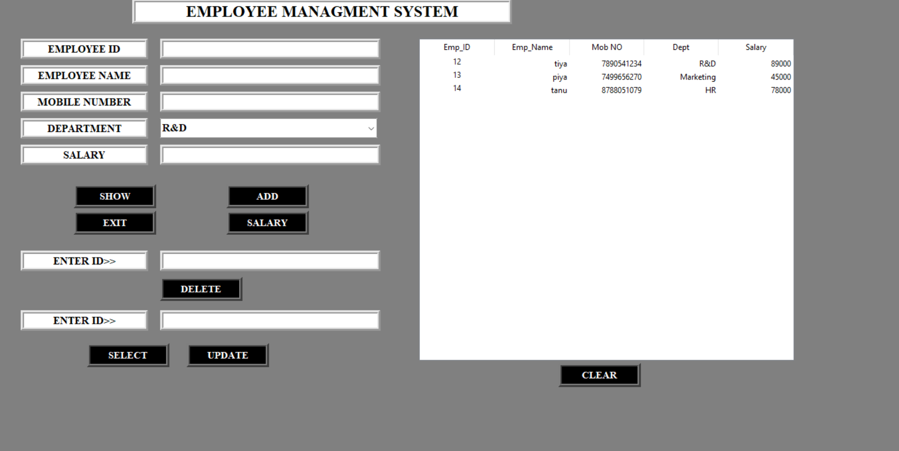

# employee_project
Step-1     create database


import pymysql
conn=pymysql.connect(user='root',host='localhost',password='Python@123')
qur='CREATE DATABASE emp_project'
mycur=conn.cursor()
mycur.execute(qur)
mycur.close()
conn.close()


Step-2 create table

import pymysql
conn=pymysql.connect(user='root',host='localhost',password='Python@123',database='emp_project')
qur='''CREATE TABLE emp (
    emp_id VARCHAR(10) PRIMARY KEY,
    emp_name VARCHAR(100),
    mob_no VARCHAR(15),
    dept VARCHAR(50),
    emp_salary VARCHAR(20)
)'''
mycur=conn.cursor()
mycur.execute(qur)
mycur.close()
conn.close()


Step-3 GUI

l2=Label(win,text='EMPLOYEE NAME',width=20,bg='white',
         fg='black',bd=5,relief='ridge',font=('times new roman',12,'bold'))


l2.place(x=100,y=120)


n1=StringVar()
e2=Entry(win,width=40,bg='white',textvariable=n1,
         fg='black',bd=5,relief='ridge',font=('times new roman',12,'bold'))


e2.place(x=310,y=120)


l3=Label(win,text='MOBILE NUMBER',bg='white',fg='black',width=20,bd=5,
        relief='ridge',font=('times new roman',12,'bold'))
l3.place(x=100,y=160)


m1=StringVar()
e3=Entry(win,textvariable=m1,bg='white',fg='black',width=40,bd=5,
        relief='ridge',font=('times new roman',12,'bold'))
e3.place(x=310,y=160)


l4=Label(win,text='DEPARTMENT',bg='white',fg='black',width=20,bd=5,
        relief='ridge',font=('times new roman',12,'bold'))
l4.place(x=100,y=200)


d1=StringVar()
e4=ttk.Combobox(win,textvariable=d1,width=38,font=('times new roman',12,'bold'))
e4.place(x=310,y=200,height=30)
e4['values']=('R&D','Marketing','Production','HR')
e4.current(0)


l5=Label(win,text='SALARY',bg='white',fg='black',width=20,bd=5,
        relief='ridge',font=('times new roman',12,'bold'))
l5.place(x=100,y=240)


s1=StringVar()
e5=Entry(win,textvariable=s1,bg='white',fg='black',width=40,bd=5,
        relief='ridge',font=('times new roman',12,'bold'))
e5.place(x=310,y=240)


b1=Button(win,text='SHOW',width=12,command=show,bd=5,relief='ridge',
          bg='black',fg='white',font=('times new roman',11,'bold'))
b1.place(x=180,y=300)


b2=Button(win,text='ADD',width=12,command=add,bd=5,relief='ridge',
          bg='black',fg='white',font=('times new roman',11,'bold'))
b2.place(x=410,y=300)


b3=Button(win,text='EXIT',width=12,command=win.destroy,bd=5,relief='ridge',
          bg='black',fg='white',font=('times new roman',11,'bold'))
b3.place(x=180,y=340)


b4=Button(win,text='SALARY',width=12,command=salary,bd=5,relief='ridge',
          bg='black',fg='white',font=('times new roman',11,'bold'))
b4.place(x=410,y=340)


Delete interface

l6=Label(win,text='ENTER ID>>',bg='white',fg='black',width=20,bd=5,
        relief='ridge',font=('times new roman',12,'bold'))
l6.place(x=100,y=400)


var1=StringVar()
e6=Entry(win,textvariable=var1,bg='white',fg='black',width=40,bd=5,
        relief='ridge',font=('times new roman',12,'bold'))
e6.place(x=310,y=400)


b5=Button(win,text='DELETE',width=12,command=delete,bd=5,relief='ridge',
          bg='black',fg='white',font=('times new roman',11,'bold'))
b5.place(x=310,y=440)

Update

l7=Label(win,text='ENTER ID>>',bg='white',fg='black',width=20,bd=5,
        relief='ridge',font=('times new roman',12,'bold'))
l7.place(x=100,y=490)


var2=StringVar()
e7=Entry(win,textvariable=var2,bg='white',fg='black',width=40,bd=5,
        relief='ridge',font=('times new roman',12,'bold'))
e7.place(x=310,y=490)


b6=Button(win,text='SELECT',width=12,command=select,bd=5,relief='ridge',
          bg='black',fg='white',font=('times new roman',11,'bold'))
b6.place(x=200,y=540)


b7=Button(win,text='UPDATE',width=12,command=update,bd=5,relief='ridge',
          bg='black',fg='white',font=('times new roman',11,'bold'))
b7.place(x=350,y=540)


treev.column("1", width = 90, anchor ='c')
treev.column("2", width = 90, anchor ='se')
treev.column("3", width = 90, anchor ='se')
treev.column("4", width = 90, anchor ='se')
treev.column("5", width = 90, anchor ='se')


treev.heading("1", text ="Emp_ID")
treev.heading("2", text ="Emp_Name")
treev.heading("3", text ="Mob NO")
treev.heading("4", text ="Dept")
treev.heading("5", text ="Salary")


# clear button
b8=Button(win,text='CLEAR',width=12,command=clear,bd=5,relief='ridge',
          bg='black',fg='white',font=('times new roman',11,'bold'))
b8.place(x=910,y=570)


Full GUI code 

import pymysql
from tkinter import *
from tkinter import messagebox
from tkinter import ttk


win=Tk()
win.title('EMPLOYEE MANAGEMENT SYSTEM')
win.config(bg='gray')
win.geometry('800x600')


def add():
        emp_id=id1.get()
        emp_name=n1.get()
        mob_no=m1.get()
        dept=d1.get()
        emp_salary=s1.get()
        if emp_id=='' or emp_name=='' or mob_no=='' or dept=='' or emp_salary=='':
                messagebox.showinfo('info','All fields are compulsory')
        else:
                conn=pymysql.connect(user='root',host='localhost',password='Python@123',database='emp_project')
                qur=f'INSERT INTO emp VALUES("{emp_id}","{emp_name}","{mob_no}","{dept}","{emp_salary}")'
                mycur=conn.cursor()
                mycur.execute(qur)
                conn.commit()
                mycur.close()
                conn.close()
                messagebox.showinfo('info','Data is inserted successfully')
                id1.set('')
                n1.set('')
                m1.set('')
                d1.set('')
                s1.set('')
               
               


def show():
        pass


def salary():
        pass


def delete():
        pass


def select():
        pass


def update():
        pass


def clear():
        pass


# main label


l0=Label(win,text='EMPLOYEE MANAGEMENT SYSTEM',width=40,bg='white',
         fg='black',bd=5,relief='ridge',font=('times new roman',18,'bold'))


l0.place(x=268,y=20)


# emp_id label and entry


l1=Label(win,text='EMPLOYEE ID',width=20,bg='white',
         fg='black',bd=5,relief='ridge',font=('times new roman',12,'bold'))


l1.place(x=100,y=80)


id1=StringVar()
e1=Entry(win,width=40,bg='white',textvariable=id1,
         fg='black',bd=5,relief='ridge',font=('times new roman',12,'bold'))


e1.place(x=310,y=80)


# emp_name >> label and entry


l2=Label(win,text='EMPLOYEE NAME',width=20,bg='white',
         fg='black',bd=5,relief='ridge',font=('times new roman',12,'bold'))


l2.place(x=100,y=120)


n1=StringVar()
e2=Entry(win,width=40,bg='white',textvariable=n1,
         fg='black',bd=5,relief='ridge',font=('times new roman',12,'bold'))


e2.place(x=310,y=120)


# mob_num >> label and entry


l3=Label(win,text='MOBILE NUMBER',bg='white',fg='black',width=20,bd=5,
        relief='ridge',font=('times new roman',12,'bold'))
l3.place(x=100,y=160)


m1=StringVar()
e3=Entry(win,textvariable=m1,bg='white',fg='black',width=40,bd=5,
        relief='ridge',font=('times new roman',12,'bold'))
e3.place(x=310,y=160)


# dept >> label and combobx


l4=Label(win,text='DEPARTMENT',bg='white',fg='black',width=20,bd=5,
        relief='ridge',font=('times new roman',12,'bold'))
l4.place(x=100,y=200)


d1=StringVar()
e4=ttk.Combobox(win,textvariable=d1,width=38,font=('times new roman',12,'bold'))
e4.place(x=310,y=200,height=30)
e4['values']=('R&D','Marketing','Production','HR')
e4.current(0)


# emp_salary >> label and entry


l5=Label(win,text='SALARY',bg='white',fg='black',width=20,bd=5,
        relief='ridge',font=('times new roman',12,'bold'))
l5.place(x=100,y=240)


s1=StringVar()
e5=Entry(win,textvariable=s1,bg='white',fg='black',width=40,bd=5,
        relief='ridge',font=('times new roman',12,'bold'))
e5.place(x=310,y=240)


# 4 buttons >> add show exit salary


b1=Button(win,text='SHOW',width=12,command=show,bd=5,relief='ridge',
          bg='black',fg='white',font=('times new roman',11,'bold'))
b1.place(x=180,y=300)


b2=Button(win,text='ADD',width=12,command=add,bd=5,relief='ridge',
          bg='black',fg='white',font=('times new roman',11,'bold'))
b2.place(x=410,y=300)


b3=Button(win,text='EXIT',width=12,command=win.destroy,bd=5,relief='ridge',
          bg='black',fg='white',font=('times new roman',11,'bold'))
b3.place(x=180,y=340)


b4=Button(win,text='SALARY',width=12,command=salary,bd=5,relief='ridge',
          bg='black',fg='white',font=('times new roman',11,'bold'))
b4.place(x=410,y=340)


# delete interface
# label  entry  button


l6=Label(win,text='ENTER ID>>',bg='white',fg='black',width=20,bd=5,
        relief='ridge',font=('times new roman',12,'bold'))
l6.place(x=100,y=400)


var1=StringVar()
e6=Entry(win,textvariable=var1,bg='white',fg='black',width=40,bd=5,
        relief='ridge',font=('times new roman',12,'bold'))
e6.place(x=310,y=400)


b5=Button(win,text='DELETE',width=12,command=delete,bd=5,relief='ridge',
          bg='black',fg='white',font=('times new roman',11,'bold'))
b5.place(x=310,y=440)


# update interface
# label entry ,select and update buttons


l7=Label(win,text='ENTER ID>>',bg='white',fg='black',width=20,bd=5,
        relief='ridge',font=('times new roman',12,'bold'))
l7.place(x=100,y=490)


var2=StringVar()
e7=Entry(win,textvariable=var2,bg='white',fg='black',width=40,bd=5,
        relief='ridge',font=('times new roman',12,'bold'))
e7.place(x=310,y=490)


b6=Button(win,text='SELECT',width=12,command=select,bd=5,relief='ridge',
          bg='black',fg='white',font=('times new roman',11,'bold'))
b6.place(x=200,y=540)


b7=Button(win,text='UPDATE',width=12,command=update,bd=5,relief='ridge',
          bg='black',fg='white',font=('times new roman',11,'bold'))
b7.place(x=350,y=540)


# tree view


treev=ttk.Treeview(win,height=23)
treev.place(x=700,y=80,width=565)


treev["columns"] = ("1", "2", "3","4","5")
treev['show'] = 'headings'


treev.column("1", width = 90, anchor ='c')
treev.column("2", width = 90, anchor ='se')
treev.column("3", width = 90, anchor ='se')
treev.column("4", width = 90, anchor ='se')
treev.column("5", width = 90, anchor ='se')


treev.heading("1", text ="Emp_ID")
treev.heading("2", text ="Emp_Name")
treev.heading("3", text ="Mob NO")
treev.heading("4", text ="Dept")
treev.heading("5", text ="Salary")


# clear button
b8=Button(win,text='CLEAR',width=12,command=clear,bd=5,relief='ridge',
          bg='black',fg='white',font=('times new roman',11,'bold'))
b8.place(x=910,y=570)


win.mainloop()


Readme file


# Employee Management System

A **GUI-based Employee Management System** developed in **Python** using **Tkinter** for the interface and **MySQL (pymysql)** as the database backend. This system allows users to **add, update, delete, view employee records, and check employee salary** in an intuitive graphical interface.

---

## Features

- **Add Employee**: Insert new employee records with ID, name, mobile number, department, and salary.
- **View Employee**: Display all employee records in a table format using `Treeview`.
- **Update Employee**: Update details of an existing employee by selecting their ID.
- **Delete Employee**: Remove employee records from the database using employee ID.
- **Salary Management**: Check salary of a specific employee by entering their ID.
- **Clear Table**: Remove all displayed data from the table for better readability.

---

## Tools & Technologies Used

- **Python 3.x**
- **Tkinter** – GUI framework for Python
- **pymysql** – Python library to connect with MySQL database
- **MySQL** – Database management system
- **ttk.Treeview** – For displaying employee records in table format

---

## Database Setup

1. Install **MySQL** and create a database:
    ```sql
    CREATE DATABASE emp_db;
    USE emp_db;
    ```

2. Create the `emp` table:
    ```sql
    CREATE TABLE emp (
    emp_id VARCHAR(10) PRIMARY KEY,
    emp_name VARCHAR(100),
    mob_no VARCHAR(15),
    dept VARCHAR(50),
    emp_salary VARCHAR(20)
)

    ```

---

## Installation & Setup

1. Clone the repository:
    ```bash
    git clone https://github.com/priyanka-bogare10042006/employee_project.git
    ```

2. Navigate to the project directory:
    ```bash
    cd employee-management-system
    ```

3. Install required Python libraries:
    ```bash
    pip install pymysql
    ```

4. Update **database credentials** in `app.py` if needed:
    ```python
    conn = pymysql.connect(user='root', host='localhost', password='Priya@123', database='emp_db')
    ```

---

## Usage

1. Run the application:
    ```bash
    python app.py
    ```

2. The main window allows you to:
    - Add a new employee
    - View all employees
    - Delete an employee
    - Update employee details
    - Check an employee’s salary

3. Use the **CLEAR** button to remove all entries displayed in the table.

---

## Screenshots

### Main Window


### Salary Window


---

## Contribution

Feel free to fork this repository and contribute.  
- Bug reports, suggestions, and improvements are welcome.

---

## License

This project is **open source** and available under the MIT License.


